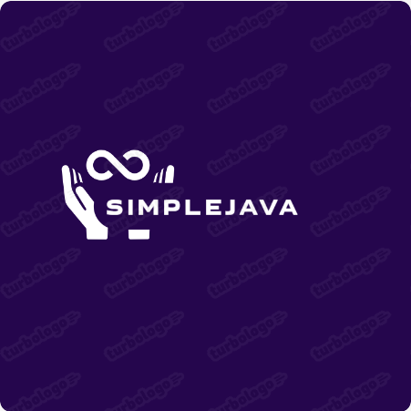
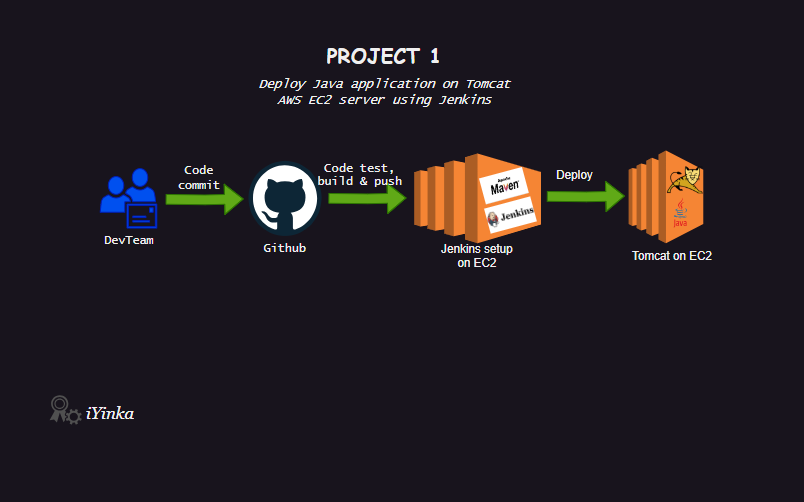

<a name="readme-top"></a>

<!--
!!! IMPORTANT !!!
This README is an example of how you could professionally present your codebase.
Writing documentation is a crucial part of your work as a professional software developer and cannot be ignored.

You should modify this file to match your project and remove sections that don't apply.

REQUIRED SECTIONS:
- Table of Contents
- About the Project
  - Built With
  - Live Demo
- Getting Started
- Authors
- Future Features
- Contributing
- Show your support
- Acknowledgements
- License

OPTIONAL SECTIONS:
- FAQ

After you're finished please remove all the comments and instructions!

For more information on the importance of a professional README for your repositories: https://github.com/microverseinc/curriculum-transversal-skills/blob/main/documentation/articles/readme_best_practices.md
-->

<div align="center">
  <!-- You are encouraged to replace this logo with your own! Otherwise you can also remove it. -->
  
  <br/>

  <h3><b>SimpleJava</b></h3>

</div>

<!-- TABLE OF CONTENTS -->

# 📗 Table of Contents

- [📖 About the Project](#about-project)
  - [🛠 Built With](#built-with)
    - [Tech Stack](#tech-stack)
    - [Key Features](#key-features)
  - [🚀 Live Demo](#live-demo)
- [💻 Getting Started](#getting-started)
  - [Prerequisites](#prerequisites)
  - [Setup](#setup)
  - [Install](#install)
  - [Usage](#usage)
  - [Run tests](#run-tests)
  - [Deployment](#deployment)
- [👥 Authors](#authors)
- [🔭 Future Features](#future-features)
<!-- - [🤝 Contributing](#contributing)
- [⭐️ Show your support](#support)
- [🙏 Acknowledgements](#acknowledgements)
- [❓ FAQ (OPTIONAL)](#faq)
- [📝 License](#license) -->

<!-- PROJECT DESCRIPTION -->

# 📖 SimpleJava <a name="about-project"></a>

<!-- > Describe your project in 1 or 2 sentences. -->

**SimpleJava** is a typical Maven CI/CD (Continuous Integration/Continuous Deployment) DevOps project which include utilizing Maven as a build automation tool and connecting it with a CI/CD pipeline for automated software delivery.

## 🛠 Built With <a name="built-with"></a>

### Tech Stack <a name="tech-stack"></a>

<!-- > Describe the tech stack and include only the relevant sections that apply to your project. -->

<details>
  <summary>Client</summary>
  <ul>
    <li><a href="https://www.java.com/">Java</a></li>
  </ul>
</details>

<details>
  <summary>Tools</summary>
  <ul>
    <li><a href="https://www.jenkins.io/">Jenkins</a></li>
    <li><a href="https://maven.apache.org/">Maven</a></li>
    <li><a href="https://tomcat.apache.org/">Tomcat</a></li>
  </ul>
</details>

<details>
  <summary>Cloud Platform</summary>
  <ul>
    <li><a href="https://aws.amazon.com/">Amazon Web Service</a></li>
  </ul>
</details>


<!-- Features -->

### Key Features <a name="key-features"></a>

<!-- > Describe between 1-3 key features of the application. -->

- **Code commit to Github**
- **Automated code testing, building and pushing**
- **Deployment to a running server**

<p align="right">(<a href="#readme-top">back to top</a>)</p>

<!-- LIVE DEMO -->

<!-- ## 🚀 Live Demo <a name="live-demo"></a>

> Add a link to your deployed project.

- [Live Demo Link](https://google.com)

<p align="right">(<a href="#readme-top">back to top</a>)</p> -->

<!-- GETTING STARTED -->

## 💻 Getting Started <a name="getting-started"></a>

<!-- > Describe how a new developer could make use of your project. -->
> Here's a quick rundown of the project's workflow:

*   Version Control: The source code for the project is saved in a version control system such as Git. Using branches and commits, developers collaborate and make changes to the codebase.
 *  CI Triggers: A CI trigger is triggered whenever a developer pushes changes to the Git repository. This trigger may be configured with a CI server such as Jenkins or GitLab CI/CD.
 *  Build Stage: The CI server fetches the most recent code, configures the necessary environment, and launches the Maven build process. Maven reads the configuration file (pom.xml) for the project, resolves dependencies, and builds the source code.
*   Unit Testing: Following the build, the CI server does automated unit tests to ensure that the code performs properly. Maven may be set to conduct unit tests using testing frameworks such as JUnit.
*   Artifact Generation: Maven generates an artifact, often a JAR or WAR file, if the build and unit tests pass successfully. The artifact includes the application's compiled code, dependencies, and other resources.

*   Deployment: The artifact is moved to a test or staging environment for additional testing and integration. Depending on the infrastructure of the project, this may be accomplished with technologies such as Ansible, Docker, or Kubernetes.
*   Integration Testing: Once the application has been deployed, additional automated integration tests may be run to evaluate its functionality and behavior in the target environment.
*   CD Pipeline: If all tests in the test/staging environment pass, the artifact may be automatically promoted to the production environment. This method is called as Continuous Deployment. Depending on the project's needs, deployment to production may include extra processes such as manual approval or additional testing.

By establishing a Maven CI/CD DevOps project, development teams may automate build, test, and deployment processes, decreasing manual work, enhancing software quality, and increasing development speed.
### Prerequisites
In order to achieve the desired results the project requires understanding of the following:
*   AWS EC2 instance
*   Jenkins configuration settings
     > Plugins to be installed on Jenkins
- [ ] Maven
- [ ] Deploy to container
- [ ] Git
*   Tomcat configuration settings

<!--
Example command:

```sh
 gem install rails
```
 -->

### Setup

The following sceenshots contains overview of the project setup:

###### Diagram
> This was done using [draw.io](https://app.diagrams.net/).
  


###### Cloud Platform
> [AWS](https://aws.amazon.com/) EC2 instances were created to run the project live.
  

<!--
Example commands:

```sh
  cd my-folder
  git clone git@github.com:myaccount/my-project.git
```
--->

### Install

Install this project with:

<!--
Example command:

```sh
  cd my-project
  gem install
```
--->

### Usage

To run the project, execute the following command:

<!--
Example command:

```sh
  rails server
```
--->

### Run tests

To run tests, run the following command:

<!--
Example command:

```sh
  bin/rails test test/models/article_test.rb
```
--->

### Deployment

You can deploy this project using:

<!--
Example:

```sh

```
 -->

<p align="right">(<a href="#readme-top">back to top</a>)</p>

<!-- AUTHORS -->

## 👥 Authors <a name="authors"></a>

<!-- > Mention all of the collaborators of this project. -->

👤 **Olayinka Victor Owolabi**

- GitHub: [@iYinka](https://github.com/iYinka)
- Twitter: [@yinka_iam](https://twitter.com/yinka_iam)
- LinkedIn: [LinkedIn](https://www.linkedin.com/in/olayinka-victor-owolabi-76467871/)
- Facebook: [Facebook](https://web.facebook.com/OlayinkaV)

<p align="right">(<a href="#readme-top">back to top</a>)</p>

<!-- FUTURE FEATURES -->

## 🔭 Future Features <a name="future-features"></a>

> In Project2 another tool for deployment will be introduced.
<!-- > Describe 1 - 3 features you will add to the project. -->

- [ ] **Ansible**

<p align="right">(<a href="#readme-top">back to top</a>)</p>

<!-- CONTRIBUTING -->

<!-- ## 🤝 Contributing <a name="contributing"></a>

Contributions, issues, and feature requests are welcome!

Feel free to check the [issues page](../../issues/).

<p align="right">(<a href="#readme-top">back to top</a>)</p> -->

<!-- SUPPORT -->

<!-- ## ⭐️ Show your support <a name="support"></a>

> Write a message to encourage readers to support your project

If you like this project...

<p align="right">(<a href="#readme-top">back to top</a>)</p> -->

<!-- ACKNOWLEDGEMENTS -->

<!-- ## 🙏 Acknowledgments <a name="acknowledgements"></a>

> Give credit to everyone who inspired your codebase.

I would like to thank...

<p align="right">(<a href="#readme-top">back to top</a>)</p> -->

<!-- FAQ (optional) -->

<!-- ## ❓ FAQ (OPTIONAL) <a name="faq"></a>

> Add at least 2 questions new developers would ask when they decide to use your project.

- **[Question_1]**

  - [Answer_1]

- **[Question_2]**

  - [Answer_2]

<p align="right">(<a href="#readme-top">back to top</a>)</p> -->

<!-- LICENSE -->

<!-- ## 📝 License <a name="license"></a>

This project is [MIT](./LICENSE) licensed.

_NOTE: we recommend using the [MIT license](https://choosealicense.com/licenses/mit/) - you can set it up quickly by [using templates available on GitHub](https://docs.github.com/en/communities/setting-up-your-project-for-healthy-contributions/adding-a-license-to-a-repository). You can also use [any other license](https://choosealicense.com/licenses/) if you wish._

<p align="right">(<a href="#readme-top">back to top</a>)</p> -->